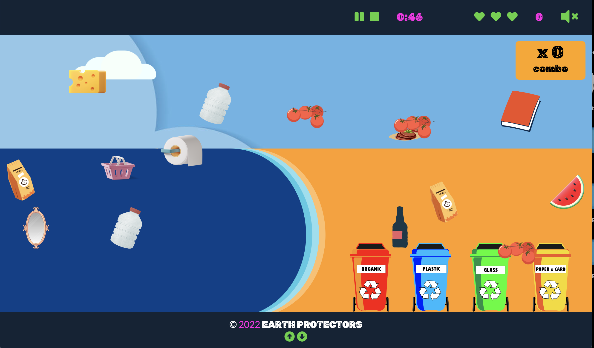

# Team: Earth Protectors - April Hackathon 

## About 

In line with this edition of the Hackathon, we have decided to develop an interactive game based on the importance of environmental cleanliness. To achieve this, we have developed a game whereby players must sort through various randomly generated items of rubbish that which they can then deem recyclable or not. In tandem with this, players will be up against a time parameter with players that finish the game in a shorter period achieving a higher position on the overall leader board. 
The overall goal of this game is to drive home a newfound knowledge base for recyclable goods. Players will be continuously learning about which pieces of rubbish are environmentally friendly to recycle whilst conversely noting which pieces of rubbish aren’t. Of course, the leader board is there to gauge each player’s skill level, but the main takeaway is that players are enjoying themselves, gaining knowledge of the environment around them and that hopefully, they can provide this newfound understanding to those around them. 

You can find the live site [here](https://iuliiakonovalova.github.io/team_3_april_hackathon/index.html).

# User Experience Design

## Strategy

### Target Audience

For our project the intention is to mainly advertise the game to the younger generations mainly within the age bracket of 6-12 years old. In particular, the demographic the project is aimed at is for those that want to learn more about the enivornment around them. 
The following areas were looked into in order to ahieve this goal of obtaining this age demographic: Gamification, Interactivity and Visual and Audio cues. A combination and the correct use of all four allows for the target audience to be attracted towards the project. The different difficulty levels provides for prolonged interest in the game itself also.

### User Stories:

#### First Time Visitor Goals:
- As a first time visitor, I want to be able to easily understand the purpose of the website, so I can decide whether I want to use it or not.
- As a first time visitor, I want to be able to easily navigate the website, so I can find what I am looking for.
- As a first time visitor, I want to be able to easily understand the rules of the game, so I can play freely.

#### Frequent User Goals:
- As a frequent user, I want to be able to learn about sorting garbage for recycling, so I can recycle my garbage in real life.
- As a frequent user, I want to enjoy the game, so I can play it regularly.
- As a frequent user, I want to be able to compete with other users, so I can motivate myself to play the game.
- As a frequent user, I want to be able to change the theme of the game, so I can enjoy a different experience.
- As a frequent user, I want to be able to learn interesting facts about the environment, so I can improve my recycling habits.

#### Parent Goals:
- As a parent of a frequent user, I want to be sure that the content is safe for children, so I can freely let my child play the game.
- As a parent of a frequent user, I want to be sure that the is no advertisement, so I can freely let my child play the game.
- As a parent of a frequent user, I want to know that my child develops good recycling habits, so I can be sure that my child will be able to recycle in real life.
- As a parent of a frequent user, I want to be sure that my child is not addicted to the game, so I can be sure that my child will be able to play the game regularly. (for the future development)
- As a parent of a frequent user, I want to be sure that my child is motivated to play the game, so I can be sure that my child receives enough motivation to recycle and actively participate in preserving our environment.
- As a parent of a frequent user, I want my child to learn additional facts about the environment, so I can be sure that my child will be able to improve his recycling habits.

## Scope

### Features

- Home page (which includes a navbar with links to all pages of the site)
- Rules page
- Leaderboard page
- Play button (located on home screen and rules page)
- Game difficulty choice
- Game theme option
- A footer which includes all team members names
- Neat and presentable UI for the game
- Countdown clock for the game
- Performance analytics for the player (including time left, score and lives)
- A sound feature to toggle on and off
- Sounds to accompany correct and incorrect game moves
- An overlay which allows a player to supply their name and score to the global leaderboard
- A game pause button
- A game stop button which allows a player to prematurely end the game as well as submitting their name and score for the leaderboard

**Navbar**

The web application has navigation buttons to navigate to the Home view, Rules Section, Leadersboard Section and a Sound control button.

The sound control button allows users to toggle the sound on and off. It looks different depending on whether the sound is on or off.

On the mobile version of the application the user will see a hamburger menu icon on the left side on the navigation bar, which will open the navigation menu, and the sound control button will be located on the right side of the navigation bar.

When the user clicks on the hamburger menu icon, the navigation menu will appear on the whole screen.

When the user starts the game, the Home, Rules and Leaders board buttons will be hidden. The game will be seen on the right side of the navigation bar.

On the mobile device the game bar will be seen in the middle of the navigation bar.

**Rules Feature**

The purpose of the Rules Feature is to give users a brief description of how to play the game.
The four bins located in the centre of the screen are buttons, which show what kind of garbage must be placed in a respective bin.
The bins appear on the screen with CSS animation delaying every bin to be displayed one after another.
When users hover over bins, CSS animation is triggered to rotate respective bins 360 deg.
Information about proper segregation of garbage is presented to a user using a modal pop-up window.

Below the garbage bin section users can find randomly selected facts related to ecology. The information is fetched from a JSON file using jQuery and presented in UI.
This section allows users to start a game with the use of the Play Button located in the right bottom corner of the section background window.
Users can exit the Rules Section with any click outside the section window (excluding the navbar and footer) or by clicking the exit button in the top left corner.

**Game Theme Feature**

The theme selection allow players to select a natural environment to clean up, as it were. Each theme was inspired a collection of pens found on CodePen (links available in credits section).

We built the CSS animations by pulling the code from the existing pens, and then manipulating it to suit our needs in seperate `test-game-bckdrop.html` files. Once satisfied with the visuals, we then migrated the code into the project. From there, the JavaScript was wired up, and layered above the animations in order to render the game.

- River Theme Foundation

- River Theme Materialized

- Ocean Theme Foundation

- Ocean Theme Materialized

- Beach Theme Foundation

- Beach Theme Materialized

**Footer Feature**

The footer is a fixed feature - always visible to the user. In addition to the copyright information, the footer includes a fun dropdown function that displays an avatar of each developer involved in the creation of this project. Each avatar links to the developers personal GitHub page. 

- Footer (Normal State)

- Footer (Active State)

### Future features

- In the future, the intention is to implement a 'time-limit' on the frequency a player can play the game. If a player plays the game in a specified number of successions they will be given a prompt notifying them of the amount of time they have spent playing the game and a suggestion that asks them to consider taking a break and coming back later. This is to ensure that parents can feel at ease as to whether or not their child will be playing the game too much. This feature will be developed further as the lifespan of the game continues into the future.

## Design

### Structure

### Color Scheme

A variety of colours were tested before settling on a combination that incorporated complementary colours that were bold, modern and most importantly fun, since the target audience is young children. 

The background colour for the navigation and footer was chosen for contrast - against the navigation content as well as the screen content, since the nav and footer are always fixed. 

- Colour Scheme 1

- Colour Scheme 2

- Nav & Footer 

- Bin Design 

The bin SVGs were custom designed by a team member in Adobe Illustrator and based on the following image obatined 

### Typography

### Imagery

### Wireframes

- [Wireframes](documentation/wireframes/WIREFRAMES_EARTH_DAY_HKTHN.pdf)

## Technologies Used

## Testing

[Click Here](TESTING.md) to view the full testing steps that were completed on every device and browser.

## Deployment

### Github
The repository was first created by logging into a GitHub account:

Clicking the 'new' green button.

This then prompts to another page with asks for a name for the new repositary. Above this input there is a dropdown menu offering a selection of various templates to utilise with the repository. The Code Institute template was chosen in order to faciliate all the shortcuts included within it to make my workflow as fast as possible.

Link to the deployed site is [here](https://iuliiakonovalova.github.io/team_3_april_hackathon/index.html).

**How to fork the GitHub Repository**

### Cloning and Forking 

In order to clone the repository, the user must visit the repository page.

Cloning by command line: Click the button beside the green button titled 'code', there you will be given various options on how you would like to clone the repository. You must then type 'git clone' into your own workspace along with the repo URL and enter.

### Forking

Go to the repositary page. In the top right of the page, below the navbar, click the 'fork' button. The fork should now be in your repositories.

**How to run this project locally**

## Credits
- [css-tricks.com](https://css-tricks.com/a-handy-little-system-for-animated-entrances-in-css/): Garbage bins animation pop-up in **Rules Section** come from: 
- [Icons8](https://icons8.com/): for providing free access to amazing icons and illustrations
- [FontAwesome](https://fontawesome.com/): for providing free icons
- [Google Fonts](https://fonts.google.com/): for providing the chosen text fonts
- [jQuery](https://jquery.com/): simple and fast syntax allowed to create functionality  of the game within short period of time
- [jQuery User Interface](https://jqueryui.com/): for free libraries which increase user interaction
- [jquery-ui-touch-punch](https://www.npmjs.com/package/jquery-ui-touch-punch) for providing a library which allows to use iquery ui draggable to work on mobile devices
- CSS Animation Resources:
  - [CodePen](http://codepen.io/wendko/pen/dyoRRbm): Beach Game Inspiration
  - [CodePen](https://codepen.io/geertjanhendriks/pen/ZEWrmd): Ocean Game Inspiration
  - [CodePen](https://codepen.io/pehaa/pen/yLVeLNg): River Game Inspiration
- [Firebase](https://firebase.google.com/): for providing a free platform to store the data
- [Build a Popup with JavaScript](https://www.youtube.com/watch?v=MBaw_6cPmAw): The modal pop-up window used for the game’s instructions section
- [Stack Overflow](https://stackoverflow.com/questions/16053866/javascript-pass-multiple-arguments-to-eventlistener-and-the-event): Passing multiple arguments with the event included to event listener 

## Acknowledgements

- Thank you to the Code Institute for hosting the Hackathon platform.
- Thank you to Jim Morel, our group facilitator from the Code Institute.
- Thank you to our amazing, hard-working team of developers! We learned so much from one another.
- And a big shout-out goes to Iuliia - our SCRUM Master :hugs: We would have been utterly lost without her!

## Collaborators

Our team is made up of a wonderful group of people from around the world - all of which are either past or present students of the [Code Institue](https://codeinstitute.net/global/)

- Aleksei [@lexach91](https://github.com/lexach91)
- James [@stuartj073](https://github.com/stuartj073)
- Iuliia [@IuliiaKonovalova](https://github.com/IuliiaKonovalova)
- Milosz [@miloszmisiek](https://github.com/miloszmisiek)
- Whitney [@Wingkelinks](https://github.com/Wingkelinks)

