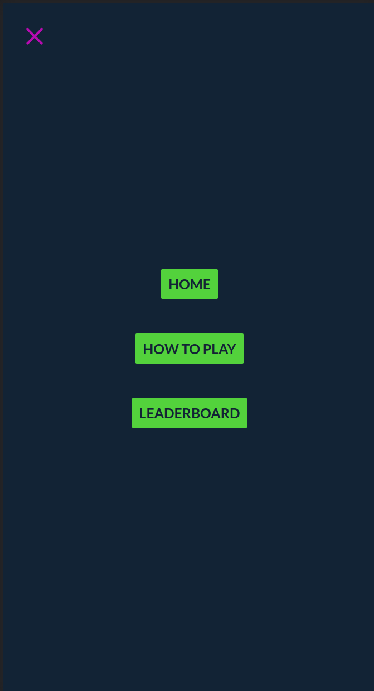
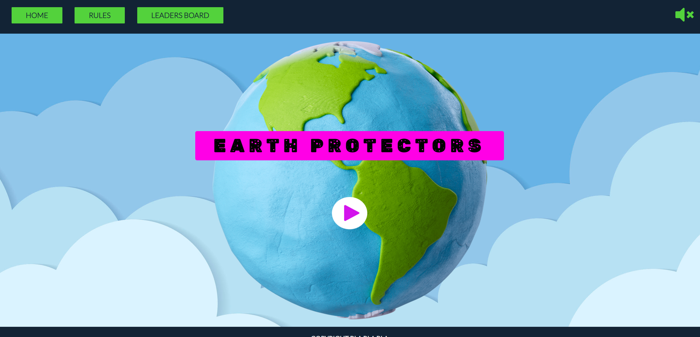
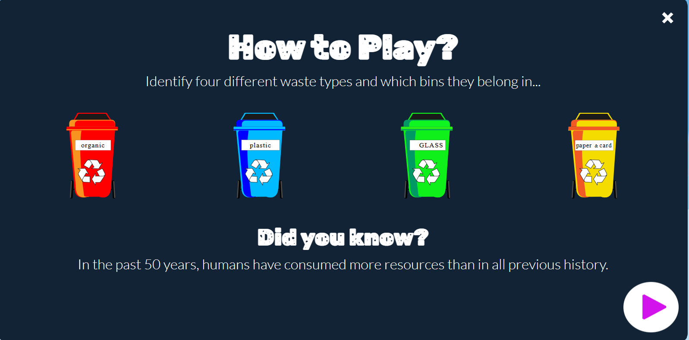
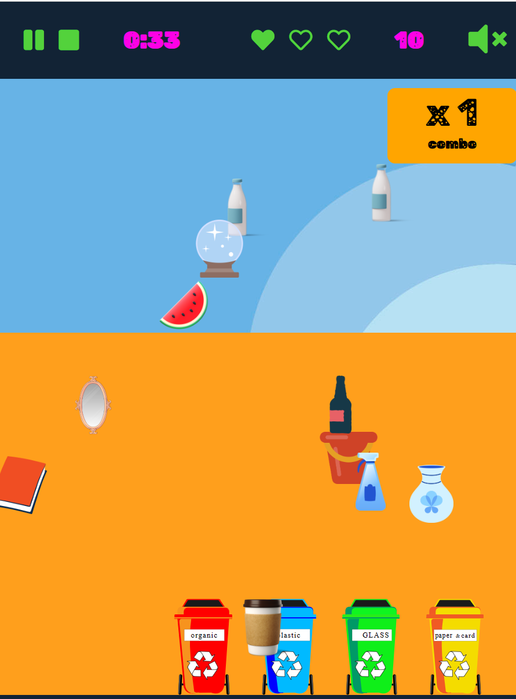
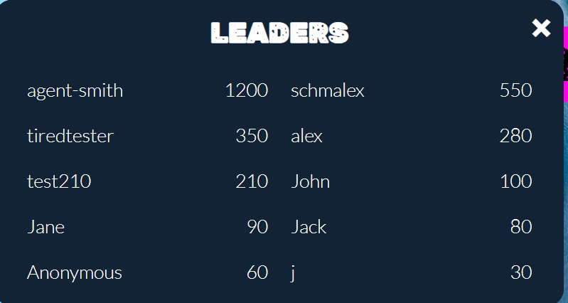
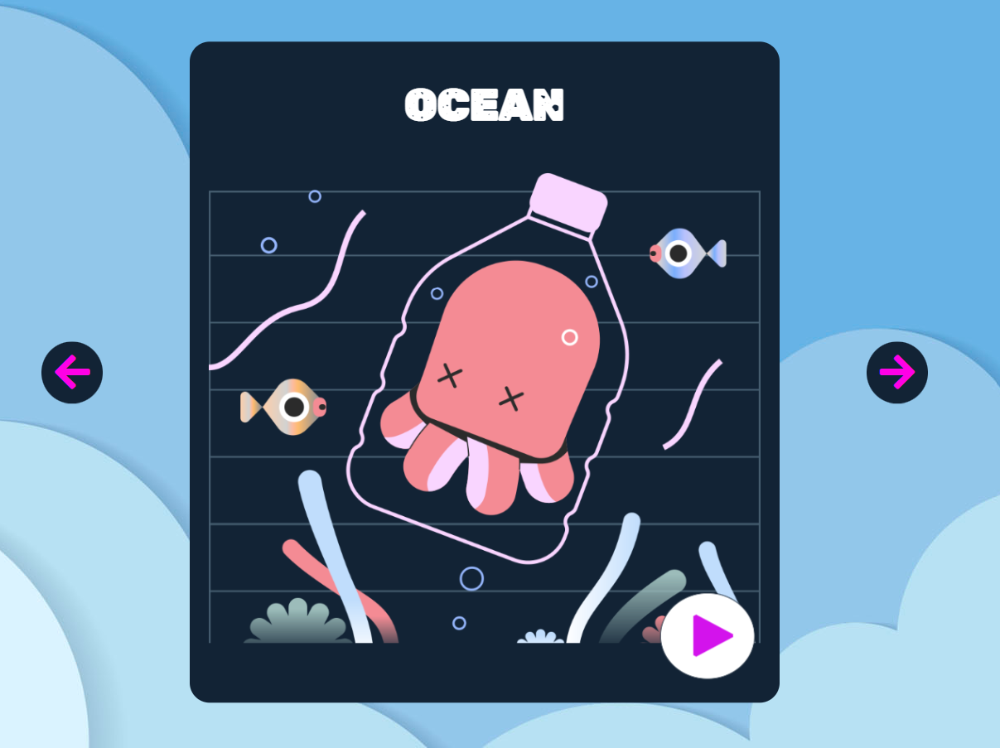
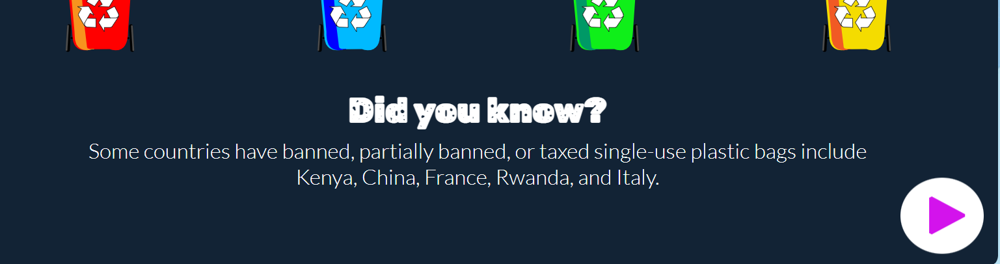

# Testing
## **Contents**
* [Manual Testing](#manual-testing)
* [Testing User Story](#testing-user-story)
* [Bugs](#bugs)
  * [Solved bugs](#solved-bugs)
  * [Known bugs](#known-bugs)
* [Validation](#validation)
  * [HTML validation](#html-validation)
  * [CSS validation](#css-validation)
  * [JS validation](#js-validation)
* [Lighthouse Report](#lighthouse-report)
* [Compatibility](#compatibility)
* [Responsiveness](#responsiveness)

|     | User Actions           | Expected Results | Y/N | Comments    |
|-------------|------------------------|------------------|------|-------------|
| **Navigation** | | |
| *Desktop menu* | | |
| Home button     | Leads to the main display      |     Y        |  Button is working as expected       |
| Rules button    | Leads to the rules page         |   Y          |  Button presents rules as expected        |
| Leader board    | Leads to the leader board       |    N/A         |     In progress     |
| Sound button     | Turn sound on/off          |     N/A        |    In progress      |
| Play button     | Difficulty level options              |      Y       |    User is able to freely choose between difficulties      |
| *Mobile menu*     |            |             |          |
| Hamburger menu  | Opens menu on the whole screen |             | If menu is opened during the game, game is paused    |
| **Difficulty level** | |             |          |
| Easy button     | Difficulty level is set to easy + leads to theme gallery |             |  Y |After choosing the easy mode, the user continues on to choose the game theme for them       
| Hard button     | Difficulty level is set to hard + leads to theme gallery |             |    Y   |After choosing the difficult mode, the user continues on to choose the game theme for them   
| **Theme Gallery** | | | |
| Arrow left     | Moves to the previous theme + leads to theme gallery |      N/A      |  |In progress        
| Arrow right     | Moves to the next theme + leads to theme gallery |          |  N/A      |In progress
| Button Play     | Starts the game |            |  Y   |Game begins as expected after the play button is pressed     
| **Footer** | | |
| Creators Button | Opens dropdown menu with creators |             |   N/A       | In progress
| Creator Avatar + Name | leads to creator's github page |             |   N/A      |In progress
| **Game View**| | | Game bar appears In the top right corner with timer, lives, and scores |
| If the user plays easy mode | No new items appear |          |    N/A      |In progress
| If the user plays hard mode | New items appear with time |           |  N/A    |In progress
| Garbage Item | moves on drag with |             |  N/A        |Items stays where the user left it
| User drops correct organic garbage item in the red bin | Success + item disappear + add scores | |N/A | sound effect if it was set by the user
| User drops correct plastic garbage item in the blue bin | Success + item disappear + add scores | | N/A |sound effect if it was set by the user
| User drops correct glass garbage item in the green bin | Success + item disappear + add scores | | N/A|sound effect if it was set by the user
| User drops correct paper garbage item in the yellow bin | Success + item disappear + add scores | | N/A|sound effect if it was set by the user
| User drops item in the correct bin | combo increase by 1 + item disappear + add scores | | N/A|sound effect if it was set by the user
| User drops item in the wrong bin | combo drops to 0 + item  goes back to screen + user loses 1 life | | sound effect if it was set by the user|
| The user cleans all screen from garbage items | All items disappear + add scores + game over + goes to the leader board | | |
| **Rules section** | | |  |
| User clicks outside of the rules block| leads to main page | |N/A | In progress
| User clicks on the rules button again| leads to rules page + with rules + 1 random fact on the environment | | |
| User clicks on the close rules button| leads to main page | | |
| User clicks on the bins | specific rules appear | | |
| User clicks on the play button | leads to chose difficulty page | | Y| After clicking the play button the user will then be led onto choosing the game difficulty
| Leader board | | |N/A | In progress

## Testing User Story

|-------------------------------|--------------------------|-------------------|
|       **User Stories**        |   **Requirements met**   |     **Image**     |
|-------------------------------|--------------------------|-------------------|
| **First Time Visitor Goals:** | | |
| As a first time visitor, I want to be able to easily understand the purpose of the website, so I can decide whether I want to use it or not. | On the landing page of the site it is clear where the user may go to learn the rules of the game. It is also clear how to play the game with the play button clearly displayed. |  |
| As a first time visitor, I want to be able to easily navigate the website, so I can find what I am looking for. | Users can navigate the site by use of a menu navigation bar | (Landing Page)[assets/images/userstories/landing.png] |
| As a first time visitor, I want to be able to easily understand the rules of the game, so I can play freely. | There is a rules menu option that pops up a window containing the rules | (Nav Menu)[assets/images/userstories/navmenu.png] |
|                               | | (Rules Popup)[assets/images/userstories/rulepopup.png] |
|                               | | |
| **Frequent User Goals:**      | | |
| As a frequent user, I want to be able to learn about sorting garbage for recycling, so I can recycle my garbage in real life. | A user has the has 3 game options, beach, river and ocean. The aim of the game is to sort the items on the screen into the correct bin. For example a book goes to the paper bin, a plastic bottle to the plastics bin| (Beach game)[assets/images/userstories/beachgame.png] |
|                               | | (River game)[assets/images/userstories/rivergame.png] |
|                               | | (Ocean game)[assets/images/userstories/oceangame.png]|
|                               | | (Play game)[assets/images/userstories/playgame.png] |
|                               | | |
| As a frequent user, I want to enjoy the game, so I can play it regularly. | At the end of a play a score board pops-up where the user may enter their game name and submit their score. Thereafter a leader board pops-up to show the scores of top players. | (Score board)[assets/images/userstories/scoreboard.png] |
|                               | | (Leader Board)[assets/images/userstories/scoreboard.png] |
|                               | | |
| As a frequent user, I want to be able to compete with other users, so I can motivate myself to play the game. | | |
| As a frequent user, I want to be able to change the theme of the game, so I can enjoy a different experience. | | |
| As a frequent user, I want to be able to learn interesting facts about environment, so I can improve my recycling habits. | | |
|                               | | |
| **Parent Goals:**             | | |
| As a parent of a frequent user, I want to be sure that the content is safe for children, so I can freely let my child play the game. | | |
| As a parent of a frequent user, I want to be sure that the is no advertisement, so I can freely let my child play the game. | | |
| As a parent of a frequent user, I want to know that my child develops good recycling habits, so I can be sure that my child will be able to recycle in real life. | | |
| As a parent of a frequent user, I want to be sure that my child is not addicted to the game, so I can be sure that my child will be able to play the game regularly. (for the future development) | | |
| As a parent of a frequent user, I want to be sure that my child is motivated to play the game, so I can be sure that my child receives enough motivation to recycle and actively participate in preserving our environment. | | |
| As a parent of a frequent user, I want my child to learn additional facts about the environment, so I can be sure that my child will be able to improve his recycling habits. | | |

## Testing user stories

### First Time Visitor Goals:

- As a first time visitor, I want to be able to easily understand the purpose of the website, so I can decide whether I want to use it or not.

When the user enters the page they are met with a neatly displayed home page which has the headings 'Home', 'Rules' and 'Leaderboard' in the navigation menu. It should be quite clear that the website is hosting an game for which users can freely play by pressing the play button.

- As a first time visitor, I want to be able to easily navigate the website, so I can find what I am looking for.

On all pages of the game (exluding when in the game) a first time visitor will easily be able to navigate their way around the website. The navigation menu clearly points toward the short and simple points of direction the website has to offer.

- As a first time visitor, I want to be able to easily understand the rules of the game, so I can play freely.

If the visitor wants to check out the rules of the game, they will be prompted with this overlay which simply outlines the objective of the game.

#### Frequent User Goals:
- As a frequent user, I want to be able to learn about sorting garbage for recycling, so I can recycle my garbage in real life.

The objective of the game posits that players will become more aware of what pieces of rubbish go into which section of recycling. As the game goes on players are given live feedback including the score they have and lives they have lost for successfully and unsuccesffully placing specific items of rubbish in the various different bins.

- As a frequent user, I want to enjoy the game, so I can play it regularly.

The score feedback of the game of the game aims to gauge a players interest and enjoyment so they can improve on their score with each time of returning.

- As a frequent user, I want to be able to compete with other users, so I can motivate myself to play the game.

The leaderboard section of the game increase the competitive nature of the game as visitors look to rise the ladder and become the best player.

- As a frequent user, I want to be able to change the theme of the game, so I can enjoy a different experience.

Users can freely decide on the specific theme they'd like to have as a backdrop for the game. Using the arrows as seen in the below screenshot, players can freely decide on choosing the ocean, river and beach theme to accompany their experience whilst playing the game.

- As a frequent user, I want to be able to learn interesting facts about the environment, so I can improve my recycling habits.

As well the 'learning by playing' nature of the game itself, the visitor can also find some interesting facts within the rules section of the website itself as seen below.

#### Parent Goals:
- As a parent of a frequent user, I want to be sure that the content is safe for children, so I can freely let my child play the game.

A key part of the process of the design of the game was ensuring that it was as safe and attractable to children as possible. The live animation that accompanies each theme whitin the game works to ensure the game is as fun as it is safe for children that play it.

- As a parent of a frequent user, I want to be sure that the is no advertisement, so I can freely let my child play the game.

As can be seen from the website (on all pages) it is free of any advertising of any kind. The main ethos is that it is a free learning environment for anyone looking to increase their environmental awareness.

- As a parent of a frequent user, I want to know that my child develops good recycling habits, so I can be sure that my child will be able to recycle in real life.

From playing the game more frequently, any visitor to the site should be learning more about recycling as they look to increase their score as time goes on.

- As a parent of a frequent user, I want to be sure that my child is not addicted to the game, so I can be sure that my child will be able to play the game regularly. (for the future development)

A future feature intended to be implemented within the game is the formation of a 'time-limit' within the game itself. This will notify players to take breaks if they play a certain amount of times in a row, thus restricting their time to that of a healthy amount behind the screen.

- As a parent of a frequent user, I want to be sure that my child is motivated to play the game, so I can be sure that my child receives enough motivation to recycle and actively participate in 
preserving our environment.

The game aims to promote a more heightened awareness of environmental cleanliness by means of having fun and competing with others. In this fashion, children can become more motivated to increase their awareness and effort in acquiring a newfound knowledge base when it comes to cleaning up rubbish whilst out in the world.

## Bugs
### Solved bugs
- Because we decided to make the game a one-page application, we ran into many issues with z-indexing of the elements that are currently on the page. Many elements were overlapping each other, and the game was not playable. Through many iterations, we were able to fix these issues.

- The game was not playable on mobile devices. Jquery UI's draggable feature was not working on mobile devices, because it does not support touch events by default. We had to use [Jquery UI Touch Punch](https://github.com/furf/jquery-ui-touch-punch) to make the game playable on mobile devices.

- When we managed to connect our leaders board to the firebase database, we had an issue with fetching the data. It appeared that firebase's function `on('value')` was opening a websocket connection to the database to all the users who are currently online. This caused the situation where if one user just posted a score, the other users who are currently online would see the score board element appear on the page. We solved this issue by using the `get` function.

- There was a bug when the user presses the "pause" button. The game would pause and the pause screen would appear, but if the user pressed "stop" button after that, the pause screen would not disappear. We solved this issue by refactoring the code for the pause and stop buttons.

- Another bug with play/pause/stop buttons was that if the user paused the game and then pressed the "stop" button, the game would stop but when the users started the game again, the game process would start, but instead of the pause button there would be a play button. We solved this issue by refactoring the code for the pause, stop buttons.

- After finishing the game, when the user pressed "submit" button, this button is replaced with a spinner to prevent the user from submitting multiple times. However, if the user would start a new game, the spinner would still be there instead of the "submit" button. We solved this issue by refactoring the code for the submit score function.

### Known bugs
- It is possible that even with using Jquery UI Touch Punch, the game would not be playable on some of the mobile devices.

## Validation:
### HTML Validation:

- No errors or warnings were found when passing through the official [W3C](https://validator.w3.org/) validator. This checking was done manually by copying view page source code (Ctrl+U) and pasting it into the validator.

### CSS Validation:

- No errors or warnings were found when passing through the official [W3C (Jigsaw)](https://jigsaw.w3.org/css-validator/#validate_by_uri) validator except the warnings about the use of css root variables and webkits for the box-shadow. However, css code works perfectly on various devices. 

### JS Validation:

- No errors or warning messages were found when passing through the official [JSHint](https://www.jshint.com/) validator. However, the validator has pointed that module variable is not used, but this variable is needed for the automated testing. Needless to say, that as the modern js syntax was used (the Optional Chaining method - `?.`) `/* jshint esversion: 11 */` was added to the top of the file.

[Back to contents](#contents)

---
## Lighthouse Report

## Compatibility

Testing conducted on the following browsers;

- Brave;
- Chrome;
- Microsoft Edge;
- Firefox;

[Back to contents](#contents)
---

## Responsiveness

Testing conducted outside of the Chrome development tool on the following;

- Oppo K7;
- Oppo K7x;
- Xiaomi Mi PAD 4;

[Back to contents](#contents)